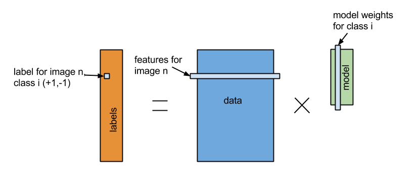
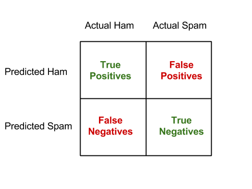

# 7. パイプラインを使ってイメージ解析
**重要１**

始める前に、以下のコマンドでMLパイプライントレーニング用のデータをダウンロードしてください。

```
$ wget http://d12yw77jruda6f.cloudfront.net/ampcamp-pipelines.zip
$ unzip ampcamp-pipelines.zip
```

この章では、試作バージョンのMLパイプラインを使ってイメージ解析機を構築したいと思います。
このアプリケーションの目的はある入力イメージ（写真）を、自動的に何が写されているかを判断することです。
鳥の写真は「トリ」のクラスを出力するはずです。
イメージ解析はこのパイプラインフレームワークでサポートされる一つのアプリケーションとされますが、このエクササイズが終わるころにはほかの応用法があると感じてもらいたいです。

解析タスクの詳細に行く前に、プロジェクトの目的とフレームワークの原則を軽くおさらいしましょう。

## 7-1. パイプラインフレームワーク
パイプラインプロジェクトの最終地点は　1)特徴を読み取る作業で使うフレームワークと　2)その複雑な学習機能を簡潔で使い勝手の良い部品から組み立てるモジュール式の機械学習として提供することです。
構築後のパイプラインは潜在的に複雑な入力データの前処理と予想過程をエンドユーザから見てわかりやすい方法で提示します。
言い直すと、一式のパイプラインは私が写真、音声、テキスト、ログなどの様々なデータを入れた際に正体を予想してくれるブラックボックスです。

パイプラインの内臓はエンドユーザに透明で解りやすいほうがいいですが、パイプラインを構築する側は明確に理解していなければいけません。
今回、あなたはパイプライン構築家になってもらいます。

あなかが使うパイプラインフレームワークは数個のシンプルな原則に基づいています。

- パイプラインは入力タイプと出力タイプを求めるノードたちから出来ています。
- 前のノードの出力タイプと次のノードの入力タイプが合っていないと組み立てられません。
- パイプライン自体もノードと考えることができて、それらを組み合わせることのよって新たなパイプラインが作成できます。
- ノードは出来る限りRDDを入力して、RDDを生産し出力します。なので、開発者は並列データ　　処理を頭に入れなければいけません。

このタイプセーフなアプローチによって、パイプラインを現実的な時間で組み立てることができ、作成したパイプラインを分散処理環境に展開することで発生する問題を最小化することができます。

今回扱うコードベースはAMPLabで構築された大きなシステムの重要な部分の試作版です。
これは以下に当てはまるノードを扱っています。

- 特徴摘出とデータ処理を行うイメージ処理
- データ正規化や拡大縮小（スケーリング）などの一般的な統計変換
- モデルを訓練する線形ソルバー

これらに加えて役に立つ機能として、作成したパイプラインのセーブやロード、選別エラーの計算方法なども含まれています。
完全なるパイプラインのレポジトリは試作品ですが、準備ができましたら披露する予定です。


## 7-2. パイプラインAPI
このAPIは公共リーリスまでに変わっているかもしれません。ここで提示されるのは試作品です。

パイプラインAPIのコアは単純で、タイプセーフ機能のプログラミングを重点的にインスパイアされています。
以下がパイプラインノードとパイプラインの定義です。

```
object Pipelines {
  type PipelineNode[Input, Output] = (Input => Output)

  type Pipeline[Input, Output] = ((Input) => Output)
}
```

Scalaが慣れてない方に説明すると、パイプラインノードはInputの入力タイプとOutputの出力タイプを繋ぐ関数と同じインターフェースです。
パイプラインノードはただの関数と考えると良いでしょう。

新しいノードを定義する時は単純にこのインターフェースを実装するクラスを書きます。
具体的には、apply(x: Input):　Outputというメソッドを呼びます。
Scalaではこの入力タイプと出力タイプは抽象概念です。

見本のノードを見ていきましょう。

```
case object Vectorizer 
  extends PipelineNode[RDD[Image], RDD[Vector]]] 
  with Serializable {
  override def apply(in: RDD[Image]): RDD[Vector] = {
    in.map(_.toVector)
  }
}
```

このノードはRDD[Image]を入力として取り込み、RDD[Vector]を出力として作り出します。
この作業は「_.toVector」を入力の各エレメントに呼んで行われます。これは明確でかなり単純な実例です。
この方法はScalaのシンタックスを利用してパイプラインを構成するなどScala言語の幾つかの機能を扱うことができます。

例としてもし二つのノード（ベクトライザと１を各ベクトルの最初に加えるノード）から出来るパイプラインを作成したい場合、以下を書きます。

```
val pipeline = Vectorizer andThen InterceptAdder 
//パイプラインは RDD[Image]を入力し １が前列に加えられたRDD[Vector]を出力します

//データセットに応用する場合はこの様になります。
val x: RDD[Image] = sc.objectFile(someFileName)
val result = pipeline.apply(x) //結果はRDD[Vector]です
//それか同類の
val result = pipeline(x)
```

この例では、InterceptAdderがVectorとして入力を求めているから動きます。

パイプライン操作は基本的にRDDトランスフォーメーションなので、Sparkで自動的にスケジュールされて効率的に実行されます。
例えば、上の実例のパイプラインはアクションが結果に発動されるまで実行されません。
さらに、二つのノードの間にあるマップ（map)のタスクは自動的に一つのタスクとして押し出され実行されます。

今から、これらのアイデアがどのように並列されたデータセットに対して複雑な機械学習のタスクを行うのかを見ていきましょう。


## 7-3. データセット
ここで使うデータセットは[CIFAR-10](http://www.cs.toronto.edu/~kriz/cifar.html)という10個のクラスに整理されている6万枚のイメージです。
ここで扱う技術は1000個のクラスや100万枚以上のイメージにも拡張できるように設計されています。

具体的には、挙げられたCIFARサイトから”binary”というデータセットを利用します。
以下のようなフォーマットと成っています。

```
<1 x label><3072 x pixel>
...
<1 x label><3072 x pixel>
```

ピクセル値と入力データ構造を合わせることは心配しなくても大丈夫です。
このデータのフォーマットに適している標準なデータローダーを供給しましたので、入力されたデータはイメージ処理するノードが求めているオブジェクト定義のイメージとして現れます。

## 7-4. 線形選別
イメージ選別方法は[MLlib](mllib.md)がサポートしてるサポートベクタマシーン、単純ベイズ、決定木、ロジスティクス回帰などたくさん存在します。
しかし、今回はその一種のモデルである線形選別に注目して、選別化ではなく特徴化がこの選択でどう影響されるかを見てみます。

線形選別は機械学習の基本操作です。線形回帰を知っている方は線形選別を理解しやすいでしょう。



「分類」　＝　「特徴」　＊　「モデルX」

数学的に、「特徴」は（n＊d）のサイズであるマトリックスAとして設定します。
nは訓練用例の数で、dは特徴元画像たちの特徴の数です。「分類」は（n＊k）のサイズであるマトリックスBに設定され、各欄にもしある画像クラスに属するものは-1.0となり、それ以外のものは+1.0となります。
線形選別機は（d＊k）のサイズであるマトリックスで平方距離｜（Ax　－ B）^2|　を最低限にするモデルXを学習します。
過剰適合を防ぐためにランダムではないモデルは罰則される正規化を使います。
線形モデルを求解するにはおおよそ（降下法）か正確（QR分解）の方法があります。
このプロジェクトでは必要な幾つかの分散ソルバーを開発しました。
これによって、あなたは詳細が分からなくてもただ呼ぶだけでモデルを作成できるでしょう。

【訳者解説】 
例えば訓練用例の4枚の写真があるとします。
2枚は鳥を写し、もう2枚は犬を写します。
訓練用例で鳥のクラスに属している画像の主な特徴が羽、爪、嘴5cm以上で、犬のクラスに属している画像の主な特徴が足、耳、尻尾5cm以上だとします。

「特徴」マトリックスA　（n=4, d=6）

|画像ID|羽  |爪  |嘴  |足  |耳  |尻尾|
|:-----|:---|:---|:---|:---|:---|:---|
|1     |8   |12  |6   |4   |0   |0   |
|2     |6   |7   |6   |5   |0   |0   |
|3     |0   |3   |0   |12  |5   |7   |
|4     |0   |2   |0   |15  |6   |9   |

「分類」マトリックスB　（n=4, k=2）

|画像ID|鳥    |犬    |
|:-----|:-----|:-----|
|1     |-1.0  |+1.0  |
|2     |-1.0  |+10   |
|3     |+1.0  |-1.0  |
|4     |+1.0  |-1.0  |

ここで、新たらしい写真に写っているものの足、耳、尻尾が5cm以下で羽、爪、嘴が5cm以上だとします。

|画像ID|羽  |爪  |嘴  |足  |耳  |尻尾|
|:-----|:---|:---|:---|:---|:---|:---|
|1     |8   |12  |6   |4   |0   |0   |
|2     |6   |7   |6   |5   |0   |0   |
|3     |0   |3   |0   |12  |5   |7   |
|4     |0   |2   |0   |15  |6   |9   |
|*5    |10  |6   |7   |3   |0   |0   |

|画像ID|鳥         |犬         |
|:-----|:----------|:----------|
|1     |-1.0       |+1.0       |
|2     |-1.0       |+10        |
|3     |+1.0       |-1.0       |
|4     |+1.0       |-1.0       |
|5     |+1.0? -1.0?|+1.0? -1.0?|

最小限モデルマトリックスX　（d=6, k=2 ）

|    |    |
|:---|:---|
|x1.1|x2.1|
|x1.2|x2.2|
|x1.3|x2.3|
|x1.4|x2.4|
|x1.5|x2.5|
|x1.6|x2.6|

平方距離が低くなるのは写っているものを鳥のクラスに選別したときです。
実際にイメージ解析する時の特徴はピクセル値の違いです。
この例ではそれを解りやすく具体的にしてみました。

## 7-5. セットアップ
ここでは、Scalaのスタンドアローンで動かします。
この章最初の重要１で説明したパイプライントレーニング用データをダウンロードしてから進めてください。
ファイルを展開しましたら、以下のものが含まれています。

```
・build.sbt: SBTのプロジェクトファイル
・LinearPixels.scala: 一番簡単に訓練して実行できるパイプライン
・RandomVocab.scala: 改善されたパイプライン
・PatchVocab.scala: 改善されたパイプラインの参考書
・data:　"cifar_train.bin" と"cifar_test.bin"のデータを含むディレクトリ
・src: 他のライブラリーを含んでいるディレクトリ
・saved_pipelines: 出来上がっているパイプラインのディレクトリ
・target: このレポジトリのJarがパッケージ化されているディレクトリ
```

**重要２**
先に進む前に、パイプラインコードを実行するターミナルでSPARK＿HOMEの環境変数の設定をしてください。

//トレーニング用ディレクトリ内で
`training/ $ export SPARK_HOME=~/training/spark`

## 7-6. 簡単なパイプライン
先ほど記述したように、CIFARデータセットのデータローダはすでに提供されています。
最初の一番シンプルなパイプラインはイメージのピクセル値を試しに使ってサポートベクタモデルを訓練します。

まずは、パイプラインのコードを見てみましょう。
LinearPixels.scalaを探してテキストエディタで開てみてください。

```
training/ $ cd pipelines/scala
vim LinearPIxels.scala
```

パイプラインの定義は[ここ](http://ampcamp.berkeley.edu/5/exercises/image-classification-with-pipelines.html#a-simple-pipeline)でも見れます。

このパイプラインは6個のノードを使用します。
データローダ、ラベル抽出、イメージ抽出、グレースケール変換器、イメージピクセルを取ってそれを線形ソルバーへ入力するベクトルに平板化するノード、そしてピクセルのモデルを訓練する線形ソルバーです。
イメージ抽出ノード、グレースケールノード、ベクトライザノードのコレクションは適用の入力に生のピクセルを変えるため、フィーチャーライザ（特徴器）と呼びます。

このコードはもう構築されていますので、パイプラインを呼ぶには以下の様にコマンドを入力してください。

```
training/ $ cd ampcamp-pipelines
$ bin/run-piepline.sh pipelines.LinearPixels data/cifar_train.bin data/cifar_test.bin
```

中間の出力後に以下の様な出力が最後にあると思います。

`training error is: 66.998, Test error is: 74.33`

これは何を意味するのでしょう？これはテストセットにモデルを適用したさいに、簡単なパイプラインは正確なクラスを25%以上の確率で予想することを表しています。
このデータセットはなるべくバランスよく10クラスに分けてあるのでランダムに予想した時の確率よりいいですが、素晴らしい結果ではありません。

なぜあまりいい結果が出なかったかを視覚的に確証してみましょう。
このプログラムはテストセットからの選別結果をlinear_pixelsというディレクトリに書きました。
ampcamp-pipelineディレクトリからlinear_pixels/index.htmlをブラウザで開けてみましょう。

`ampcamp-pipelines/ $ open linear_pixels/index.html`

## 7-7. 改善後のパイプライン
ではどうやったら75%のエラーを改善できるでしょうか？
秘訣は以前のパイプライン講演であなたが聞いたことがあるビジュアルボキャブラリ[[9]](#[9])です。
エディタでRandomVocab.scalaを開いてみてください。
主な違いはフィーチャライザの定義です。

```
val featurizer =
  ImageExtractor
    .andThen(new Convolver(sc, filterArray, imageSize, imageSize, numChannels, None, true))
    .andThen(SymmetricRectifier(alpha=alpha))
    .andThen(new Pooler(poolStride, poolSize, identity, _.sum))
    .andThen(new ImageVectorizer)
    .andThen(new CachingNode)
    .andThen(new FeatureNormalize)
    .andThen(new InterceptAdder)
    .andThen(new CachingNode)
```

これを実行して何が出てくるかをみてましょう。
コンソールで以下をコマンド実行します。

`ampcamp-pipelines/ $ bin/run-pipeline.sh pipelines.RandomVocab data/cifar_train.bin data/cifar_test.bin 200 10 0.2`

新しく3つの引数が付いたのにお気づきでしょう。
これらは、使用するビジュアルボキャブラリのサイズ（200）、規定化のパラメータ（10）、訓練する入力データの分数です（0.2）。ここで最後の数が20%なのは時間の問題です。

フィーチャライザが複雑化されたのを確認できます。
具体的に、入力イメージに適用されるフィルターが集まっているフィルタ配列が作成されました。
このフィルタはランダムで正規分布から発生します。
これらがビジュアルボキャブラリです。
ここから200個の各フィルタを入力イメージに適用してイメージ四部円にばら撒きます。
ビジュアルボキャブラリ内の異なったフィルタごとに違う働きをします。
そしてバイアス項を追加し、これとばら撒き結果を線形選別機の引数に入れます。

数分後にはコードが実行され次ような答えを出します。

`Training error is 36.235596, Test error is 42.88`

再び視覚化された結果を目で見てみましょう。
ファイルはrandom_cifarディレクトリに存在します。

`ampcamp-pipelines/ $ open random_vocab/index.html`

### <font color="black">7-7-(1). 上級エクササイズ</font>
時間がある方はパイプラインのパラメータを変えて試してください。例えば異なった正規化値かフィルタの数（100か300）を入れてください。正確性はどう変化しますか？

## 7-8. 上級パイプライン
一つ前のパイプラインではランダムなビジュアルボキャブラリを使い、同じデータサンプルに対して最初の簡単なパイプラインよりいい結果がでましたが、もう少し解析成果を上げられる所まで行きましょう。

この問題で最後に行うことは改善されたビジュアルボキャブラリを使うことです。
そのために、パッチ抽出と白色化をします。
何のことかはPatchVocab.scalaを開いて見てください。
このパイプラインと先ほどのパイプラインの違いは以下が加えられたことだと分かるでしょう。

```
val patchExtractor = ImageExtractor
      .andThen(new Windower(patchSteps,patchSize))
      .andThen(new ImageVectorizer)
      .andThen(new Sampler(whitenerSize))

    val (filters, whitener) = {
        val baseFilters = patchExtractor(trainData)
        val baseFilterMat = Stats.normalizeRows(new MatrixType(baseFilters), 10.0)
        val whitener = new ZCAWhitener(baseFilterMat)

        //Normalize them.
        val sampleFilters = new MatrixType(Random.shuffle(baseFilterMat.toArray2.toList).toArray.slice(0, numFilters))
        val unnormFilters = whitener(sampleFilters)
        val twoNorms = MatrixFunctions.pow(MatrixFunctions.pow(unnormFilters, 2.0).rowSums, 0.5)

        (((unnormFilters divColumnVector (twoNorms.addi(1e-10))) mmul (whitener.whitener.transpose)).toArray2, whitener)
    }
```

ここではフィルタがFloatMatrix.randn()関数でランダムに発生するのではなく、データからサンプルされて生み出されます。
これはランダムな（テレビの砂嵐のような）ノイズにイメージを合わせるのではなく、すでに認識されているものに似ているかで合わせる強力な発想です。

## 7-9. 訓練済みのパイプラインをロードする
時間内でトレーニングデータをフィーチャライズしてあなたのマシーンの上でモデルを訓練するのに必要な計算能力の関係で、訓練済みのパイプラインを追加機能と一緒に提供します。
このパイプラインはコードにある同じジャバオブジェクトがシリアライザ化された状態で”*.pipe”ファイルに纏めてあります。

訓練されたパイプラインをセーブ、ロード、適用するコードは以下に単純です。

```
import utils.PipelinePersistence._

//パイプラインをセーブする
savePipeline(predictionPipeline, "saved_pipelines/your_pipeline.pipe")
    
/ディスクからパイプラインをロードする
val predictionPipeline = loadPipeline[RDD[Image],RDD[Array[DataType]]]("saved_pipelines/your_pipeline.pipe")
    
//予測に使うパイプラインを新しいデータに適用する
val data: RDD[Image]
val predictions = predictionPipeline(data)
```

すぐに見れますが、訓練したパイプラインをロード、テストセットに対して評価、正確性をプリントする簡潔なスクリプトも提供してあります。
これでパイプラインの配置設定が簡単だと気づくでしょう。
もし訓練したオブジェクトに満足でしたら、Veloxなどのモデルを提供するサービスに配送するだけで終了です。
設計どうりです。

## 7-10. パイプライン評価の概要
今まではパイプライン評価をする際に選別器エラーだけに集中してきました。
しかし、選別器の評価方法はこれよりもっと凝っています。
スパム探知の例を見てみましょう。
ユーザとしては受信箱にスパムの数が少ないほうがいいですが、重要なメールは見逃したくはありません。
不正確な選別の場合、間違った失敗（重要なメッセージが取り除かれること）のほうが性能不良（スパムが受信箱にに残ること）より敏感になります。
ですから、スパム探知のモデルを評価する場合この様な分割り表で表せます。



この分割り表はマルチクラス設定の場合も法則化できまして、その例は後ほど見れます。

## 7-11. パイプラインの評価
先ほど構築したパイプラインをテストセットに適用した際の評価は以下の様に行います。

`ampcamp-pipelines/ $ bin/run-pipeline.sh pipelines.EvaluateCifarPipeline saved_piplines/patchvocab.pipe data/cifar_test.bin 0.2`

|      |plane	|car	 |bird	|cat	 |deer	|dog	 |frog	|horse |ship  |truck |
|:-----|:-----|:-----|:-----|:-----|:-----|:-----|:-----|:-----|:-----|:-----|
|plane |741   |26    |79    |24    |29    |18    |3     |22    |73    |33    |
|car   |26    |791   |20    |16    |8     |13    |6     |10    |44    |64    |
|bird  |37    |12    |511   |62    |56    |64    |50    |42    |13    |10    |
|cat   |12    |16    |66    |456   |50    |143   |42    |29    |12    |7     |
|deer	 |19    |8     |81    |45    |582   |42    |47    |43    |8     |5     |
|dog   |5     |5     |71    |187   |29    |608   |19    |59    |5     |10    |
|frog  |18    |17    |94    |103   |99    |39    |807   |17	   |6     |15    |
|horse |22    |8     |46    |47    |97    |42    |11    |749   |4     |11    |
|ship  |80    |38    |17    |26    |20    |14    |10    |7     |801   |22    |
|truck |40    |79    |15    |34    |30    |17    |5     |22    |34    |823   |

`Classification error on data/cifar_test.bin is: 31.31`

この様な答えが出力の一部として出てくると思います。
テーブルの列がモデルで予測された内容で、行が正確なクラスです。
ある（r, c）欄はテストセットでr回予想された中で本当のクラスはcだったを示しています。
右下斜めの欄が正確に予想された数で、それ以外は混乱した数です。

一番多い正解クラスは何ですか？これは合理的ですか？

最後に、patch_cifarの視覚的出力を見てください。
このモデルは今までに比べてよくなっていますか？

`ampcamp-pipelines/ $ open patch_vocab/index.html`

## 7-12. 番外編
上級エキセサイズ２

もう一つ保存されているパイプラインが”saved_pipelines”フォルダに入っています。
このパイプラインは評価するのに時間がもっとかかりますが、エラー率がさらに良くなります。
このパイプラインを作成したコードはPatchVocab2.scalaです。

`ampcamp-pipelines/ $bin/run-pipeline.sh pipelines.EvaluateCifarPipeline saved_pipelines/patchvocab2.pipe data/cifar_test.bin 0.2`

このパイプラインは比較的に多い2000サンプルパッチを使って訓練され、24%テストエラーを記録します。
訓練するためにはもう少し複雑な、ブロック標降下という結果を向上させる技術のパイプラインを使用しました。

もし10,000パッチまでスケールアップして、正しい正規化値を選ぶと15%エラーまで上がることが分かっています。
この技術は水平にスケールが可能で最先端の学問結果と並ぶ成績です。

上級エキセサイズ３

最後にパイプラインをいじって再コンパイルしてください。
パイプラインはテキストエディタかScalaをサポートするIDEで書き直せてsbt assemblyでコンパイルできます。
パイプラインを白色化やインターセプトを加えないで訓練して、パフォーマンスがどう変化するのかを見てください。

まとめ

この練習でイメージ解析をSparkでするのに3つのサンプルパイプラインを構築し評価しました。
このフレームワークは簡単で一般的に使えるほど機械学習の流れに似ています。このプロジェクトはまだ始まったばかりなので、フィードバックを貰えるとうれしいです。

----------
<a id="[9]"></a>
[9] ビジュアルボキャブラリ: 画像の特徴点を抽出したものの集まり。
