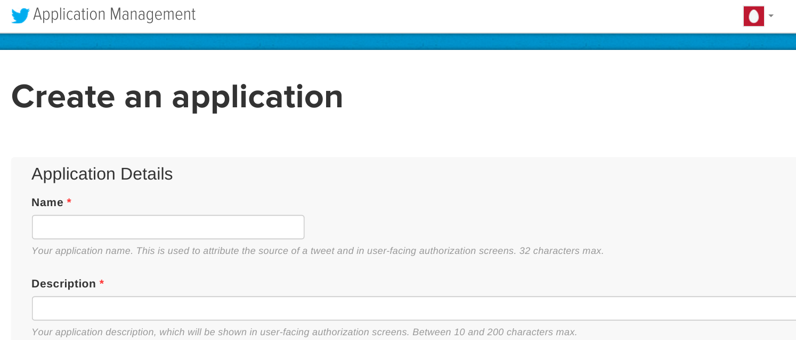
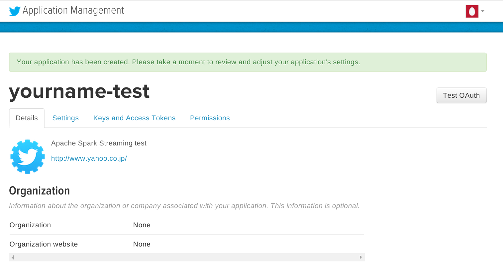
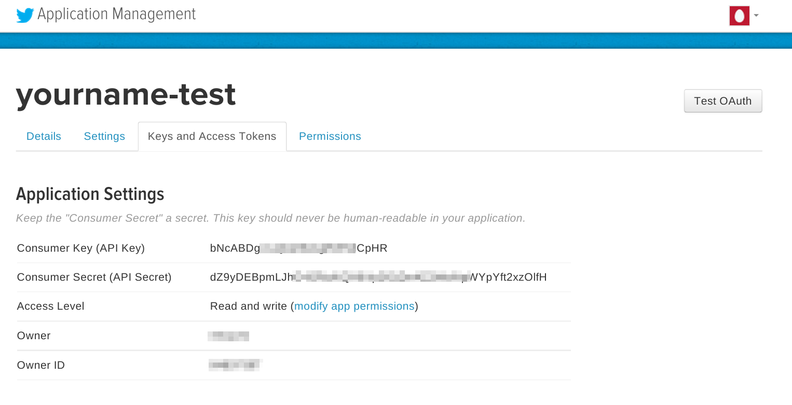
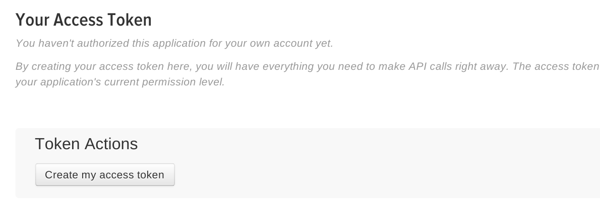

ストリーミング処理とは、twitterやfacebookのように、絶え間なく流れてくるリアルタイム・ストリームデータを入力として受け付け、逐次処理を行うことを言います。
Sparkが持つSpark Streamingライブラリは非常にスケーラブルであり、高い可用性を持ったストリーム処理を行うことができます。

このトレーニングでは、実際のtwitterのストリームデータを受け付け、処理するプログラムを作成します。
プログラムはScala, Javaで記述することができます。(注：本書ではScalaのプログラムのみを取り上げます)

# 3-1. トレーニング用ファイルの構成、事前に用意するもの
トレーニング用ファイルは以下のような構成になっています

|ファイル名                                   |内容                                                     |
|:--------------------------------------------|:--------------------------------------------------------|
|training/streaming/scala/build.sbt           |SBTプロジェクトファイル                                  |
|training/streaming/scala/Tutorial.scala      |本トレーニングで実際に編集・コンパイル・実行するファイル |
|training/streaming/scala/TutorialHelper.scala|Tutorial.scalaから呼び出されるヘルパー関数のファイル     |

ヘルパー関数として以下のものをあらかじめ用意しています。

- getCheckpointDirectory(): Spark Streamingで使用されるチェックポイントディレクトリを取得する関数
- configureTwitterCredential(): Twitterのクレデンシャルを取得するためのヘルパー関数。詳細は後述。

また、Twitterのアカウントがない場合は事前に取得するようにしてください。
Twitterアカウントに携帯電話番号が登録されている必要があります。

<a id="3-2"></a>
# 3-2. Twitterのクレデンシャルを取得する
このトレーニングではTwitterのストリームデータを使用するため、Twitterによる認証を行う必要があります。
これにはTwitterのアカウントを取得することで使用できる、”Consumer Key”と”Consumer Secret”のペアと、”Access Token”と”Access Key”のペアが必要になります。
これにより、アプリケーションはTwitterのユーザ名、パスワードを使用することなくアカウントの情報や、各種のストリームデータを利用することができるようになります。

これから作成する”Consumer Key”と”Consumer Secret”のペアと、”Access Token”と”Access Key”のペアは一時的な利用にとどめ、このトレーニングが終わったら破棄することもできます。
これによりトレーニングによって作成されたプログラムを使用して、他のユーザがあなたのアカウントのストリームを見たり、書き込んだりすることを防ぐことができます。

それではTwitterのクレデンシャルを取得しましょう。ブラウザで[Twitterのアプリケーション管理ページ](https://dev.twitter.com/apps)を開きます。(必要に応じてTwitterにサインインしてください。なお手順を完了するためには、事前にTwitterアカウントに携帯電話番号が登録されている必要があります)


このトレーニングのアプリケーションのために、新しくクレデンシャルを作成します。画面右上の[Create New App]ボタンをクリックします。



画面内に必要事項を入力します。このトレーニングでは以下のように入力します。

Name: [twitterのハンドル名]-test

Description: Apache Spark Streaming test

Website: http://www.yahoo.co.jp/ (なんでもよいが、ブラウザで開けるページが好ましい)

Callback URL: (空欄)

全ての項目を埋めたら、”Developer Aggreement”にチェックを入れ、[Create your Twitter application]をクリックします。

作成が完了すると以下のようなページに遷移します。



上記ページ中の[Keys and Access Tokens]タブを開きます。
すでに”Consumer Key(API Key)”および”Consumer Secret(API Secret)”が生成されていることが分かります。

注意：特に”Consumer Key”および”Consumer Secret”は安全に管理し、他の人と共有しないようにしてください。”Consumer Key(API Key)”および”Consumer Secret(API Secret)”の組み合わせで、他の人があたかもあなたのアカウントでTwitterの認証を通過できる可能性があります。



ページ下部の[Create my access token]ボタンを押します。

これで”Access Token”と”Access Key”のペアが作成されます。

注意：”Access Token”と”Access Key”のペアは安全に管理し、他の人と共有しないようにしてください。”Access Token”と”Access Key”の組み合わせで、他の人があたかもあなたのアカウントでTwitterのAPIを利用できる可能性があります。



ここまでの手順で以下の情報が入手できました。

- Consumer Key(API Key)
- Consumer Secret(API Secret)
- Access Token
- Access Key

この情報を使用して、Spark Streamingアプリケーションを作成します。

# 3-3. Spark Streamingアプリケーションの作成
トレーニングプログラムには以下のようなScalaスクリプトのひな形があります。これを元に、順番に機能を追加し、最終的なアプリケーションを作成します。

`training/streaming/scala/Tutorial.scala`

```
object Tutorial {
  def main(args: Array[String]) {

    // Checkpoint directory
    val checkpointDir = TutorialHelper.getCheckpointDirectory()

    // Configure Twitter credentials
    val apiKey = "(追加)"
    val apiSecret = "(追加)"
    val accessToken = "(追加)"
    val accessTokenSecret = "(追加)"
    TutorialHelper.configureTwitterCredentials(apiKey, apiSecret, accessToken, accessTokenSecret)

    // Your code goes here

  }
}
```


上記の”(追加)”には、[3-2.](#3-2)で作成した、それぞれのキーをセットします

次に、”Your code goes here”の部分にプログラムを追加していきます。

最初に以下の命令を入れます

`val ssc = new StreamingContext(new SparkConf(), Seconds(1))`

これによりSparkのStreamingContextオブジェクトを作成します。SparkConfオブジェクトと、バッチ実行間隔を指定します。
上記の例では”1秒”を指定しています。
つまり1秒間に取得したストリームデータが、１つのバッチジョブとして分割実行されるという指定になります。

`val tweets = TwitterUtils.createStream(ssc, None)`

変数tweetsはDStreamクラスで表現されたTwitterのステータスの一覧です。
より具体的に言うのであれば、変数tweetsは[twitter4j.Statusクラス](http://twitter4j.org/javadoc/twitter4j/Status.html)を内部に持つRDDオブジェクトの連続(配列)であると言うことができます。 

ここまでで、上記にセットした認証情報を元にアプリケーションはTwitterに接続できるはずです。正しく接続されたかを確認するために、ステータス(=実際のツイート内容)を書き出してみます。

```
val statuses = tweets.map(status => status.getText())
statuses.print()
```

   【備考】
   
   tweets.map(status => status.getText()) に使用される”=>”はScalaにおいては「ラムダ式」と解釈され、無名関数として使用されています。つまりここでのtweets.statusプロパティは、getText()メソッドによってString(文字列)に変換された上で、DStreamオブジェクトであるstatusesに格納されます。

tweets.mapメソッドにより、tweetsストリームにおける個々のstatusプロパティは、getText()メソッドによって文字列に変換されたのちに、statusesという名前のDStreamオブジェクトにそれぞれマッピングされます。

printメソッドは、statuses DStreamオブジェクトの最初の10個を出力します。これは1秒ごとに実行されます。

またストリーミングにおいては定期的にチェックポイントデータをディスクに書き出し、データの損失を防止します。

`ssc.checkpoint(checkpointDir)`

最後にStreamingContextの実行を開始するよう指示します。DStreamオブジェクトへの操作は、この”ssc.start()”の前に書かれていることが必要です。

```
ssc.start()
ssc.awaitTermination()
```

これでプログラムができました。
改めてプログラム全体を再掲します。緑字部分がもともとのテンプレートから変化した部分です。

`training/streaming/scala/Tutorial.scala`

```
import org.apache.spark._
import org.apache.spark.SparkContext._
import org.apache.spark.streaming._
import org.apache.spark.streaming.twitter._
import org.apache.spark.streaming.StreamingContext._
import TutorialHelper._

object Tutorial {
  def main(args: Array[String]) {

    // Checkpoint directory
    val checkpointDir = TutorialHelper.getCheckpointDirectory()

    // Configure Twitter credentials
    val apiKey = "bNcABXXXXXXXXXXXXX5dCpHR"
    val apiSecret = "dZ9yDEBpmLJhOXXXXXXXXXXXXXXXXXXXft2xzOlfH"
    val accessToken = "NNNNNNNN-RZH5M1MFxTNXXXXXXXXXXXXXXXXXXl9tl2"
    val accessTokenSecret = "UBRkxVeTXXXXXXXXXXXXXXXXXXXXX0aOn0kuT6FIfUhpxst"
    TutorialHelper.configureTwitterCredentials(apiKey, apiSecret, accessToken, accessTokenSecret)

    // Your code goes here
    val ssc = new StreamingContext(new SparkConf(), Seconds(1))
    val tweets = TwitterUtils.createStream(ssc, None)
    val statuses = tweets.map(status => status.getText())
    statuses.print()
    ssc.checkpoint(checkpointDir)
    ssc.start()
    ssc.awaitTermination()
  }
}
```

# 3-4. サンプルアプリケーションのコンパイル・実行
さて、作成したプログラムを実行してみます。

SBTのプロジェクトファイルを修正(赤字部分)します。

`training/streaming/scala/build.sbt`

```
import AssemblyKeys._ // put this at the top of the file

name := "Tutorial"

scalaVersion := "2.10.4"

libraryDependencies += "org.apache.spark" % "spark-streaming_2.10" % "1.4.1"
libraryDependencies += "org.apache.spark" % "spark-streaming-twitter_2.10" % "1.4.1"

resourceDirectory in Compile := baseDirectory.value / "resources"

assemblySettings

mergeStrategy in assembly := {
  case m if m.toLowerCase.endsWith("manifest.mf")          => MergeStrategy.discard
  case m if m.toLowerCase.matches("meta-inf.*\\.sf$")      => MergeStrategy.discard
  case "log4j.properties"                                  => MergeStrategy.discard
  case m if m.toLowerCase.startsWith("meta-inf/services/") => MergeStrategy.filterDistinctLines
  case "reference.conf"                                    => MergeStrategy.concat
  case _                                                   => MergeStrategy.first
}
```

SBTのプロジェクトプロパティをセットします。

`training/streaming/scala/project/build.properties`

```
sbt.version=0.13.8
```

カレントディレクトリがtraining/streaming/scalaであることを確認したのちに、以下のコマンドを実行します。

```
$ ../../../spark-1.4.1/sbt/sbt assembly
Getting org.scala-sbt sbt 0.13.8 ...
:: retrieving :: org.scala-sbt#boot-app
	confs: [default]
	44 artifacts copied, 0 already retrieved (13482kB/128ms)
Getting Scala 2.10.4 (for sbt)...
:: retrieving :: org.scala-sbt#boot-scala
	confs: [default]
	5 artifacts copied, 0 already retrieved (24459kB/66ms)
(中略)
[info] SHA-1: db07995883e8df5cd625db9723f10cb3667fa4c0
[info] Packaging /home/kiuchi/training/streaming/scala/target/scala-2.10/Tutorial-assembly-0.1-SNAPSHOT.jar ...
[info] Done packaging.
[success] Total time: 42 s, completed 2015/06/14 23:48:38
$
```

＊エラー事例

```
attempting to fetch sbt
/root/spark-1.4.1/build/sbt-launch-lib.bash: line 54: build/sbt-launch-0.13.8.jar.part: No such file or directory
/root/spark-1.4.1/build/sbt-launch-lib.bash: line 54: build/sbt-launch-0.13.8.jar.part: No such file or directory
Our attempt to download sbt locally to build/sbt-launch-0.13.8.jar failed. Please install sbt manually from http://www.scala-sbt.org の場合
```

＊エラー修正

```
{$SparkHome｝# wget https://dl.bintray.com/sbt/native-packages/sbt/0.13.8/sbt-0.13.8.zip
#unzip sbt-0.13.8.zip
# cd ~/training/streaming/scala/
# mkdir build
# cp ~/spark-1.4.1/sbt/bin/sbt-launch.jar build/sbt-launch-0.13.8.jar
```

これでSBTを使用してプロジェクト全体が再構成され、Tutorialクラスがコンパイルされました。
出来上がった実行バイナリは、training/streaming/scala/target/scala-2.10/Tutorial-assembly-0.1-SNAPSHOT.jar にあります。
それではこの実行バイナリをspark-submitコマンドでSparkに投入します。

```
$ ../../../spark-1.4.1/bin/spark-submit --class Tutorial target/scala-2.10/Tutorial-assembly-0.1-SNAPSHOT.jar
```

以下のように1秒毎に、ストリーム入力としてのTwitterストリームを受け取り、statusプロパティ(つまりツイート内容)の先頭10個を表示します。終了するにはCtrl+Cを押します。

```
OpenJDK 64-Bit Server VM warning: ignoring option MaxPermSize=128m; support was removed in 8.0
Configuring Twitter OAuth
	Property twitter4j.oauth.consumerKey set as [bNcABDXXXXXXW5dCpHR]
	Property twitter4j.oauth.accessToken set as [94807397-RZH5M1MFXXXXXXXXXE8ZfU3XXXXXXXVKl9tl2]
	Property twitter4j.oauth.consumerSecret set as [dZ9yDEBpmLJhO4SRaXiQXXXXXXXXX2MoiNXXXXXpYft2xzOlfH]
	Property twitter4j.oauth.accessTokenSecret set as [UBRkxVeTWEwdcfXXXXXXXXXXXXXXXXXXFIfUhpxst]

Using Spark's default log4j profile: org/apache/spark/log4j-defaults.properties
15/06/15 00:04:20 INFO Slf4jLogger: Slf4jLogger started
15/06/15 00:04:21 INFO Remoting: Starting remoting
15/06/15 00:04:21 INFO Remoting: Remoting started; listening on addresses :[akka.tcp://sparkDriver@laptop.mkhome:57181]
15/06/15 00:04:21 INFO Remoting: Remoting now listens on addresses: [akka.tcp://sparkDriver@laptop.mkhome:57181]
15/06/15 00:04:22 INFO TwitterStreamImpl: Establishing connection.
15/06/15 00:04:23 WARN NativeCodeLoader: Unable to load native-hadoop library for your platform... using builtin-java classes where applicable
15/06/15 00:04:23 INFO TwitterStreamImpl: Connection established.
15/06/15 00:04:23 INFO TwitterStreamImpl: Receiving status stream.
-------------------------------------------
Time: 1434294265000 ms
-------------------------------------------
次回のパワプロでもサクセス以外にも金かかる要素つくんかな？OBや球場一つ何円とか。
RT @T4__kr23: たくちゃんがラスク食ってる！？！？ http://t.co/0vZqm6KrVn
RT @EvaDavai: Acabando la fiesta con @RenatoEscobarX 100% recomendable. ;) Te mando besos. http://t.co/OgneoW3RBe
誤字った死にたい
31/99 الهداف الكبير إلى أن مباريات آخر الموسم، تكون طاقة اللاعبين قد بلغت مداها، وضعف تركيزهم الذهني، ولا يمكن تنشيط هذين العاملين في
RT @TOWER_Anime: 6/15お誕生日の方、続いては、『さよなら絶望先生』木津千里さん、『らき☆すた』宮河ひなたさん、『暗殺教室』片岡メグさん、『ニセコイ』小野寺小咲さん、おめでとうございます!
次はポスター...フレームには入れた...
@0315Belieber 確かねーその人こばやしえいきって名前だったなー
@ItzMeyz06 @azilxeiyn_ @keithawdrey @JelynJileng  THANK YOU ATE!! GOODNIGHT! MWAAH 😘
@8 @S_Mitsutada_not  困るだろうなって､分かってたから誰にも言った事は無いですよ｡すみません｡言っちゃった｡ 本心から気にならない､か｡…うん｡わかりました｡その本質を違えないよう誠心誠意接しさせてもらいます｡  湯浴みも未だだったのに､長々とごめんね
…
(中略)
-------------------------------------------
Time: 1434294280000 ms
-------------------------------------------
GRABEEE ENRIQUEEE CRUSH NA ULIT KITA!!!!!!!! 😍😍😍
@matthunter123 any plans?
RT @BrentRivera: GOOD MORNING 😊❤️
@fuyu_no_usa おやすみ、俺の天使。はは、お嬢ちゃんの隣で眠れるってのは幸せだな。天使がいる場所ってことで、俺は天国で眠れるのか。……俺なんかがもったいないねぇ
RT @DengOww: @CaylaLoraine_ lol bat reserts at robotics lang ata samin huehue
RT @almiseelanews: الجنرال السعودي انور عشقي : نعم التقيت بمدير عام وزارة الخارجية الاسرائيلي والتطبيع السعودي الإسرائيلي ممكن اذا حصل "الف…
http://t.co/IGZkw91Pb8 http://t.co/tZO6SQ4cfI http://t.co/VgdTXoIsyc http://scler...
俺だってあさぽんと生電話するときでもここまで緊張してなかったぞｗｗｗｗｗｗｗｗｗｗｗｗｗｗｗｗｗ #ラジオネーム恋するウサギちゃん
@syanuko3 あ
RT @collegefession: "I started pounding a beat on my dorm room wall.. 5 minutes later I eventually got 20 people making music from differen…
…
(ここでCtrl+Cを押下)
$ 
```

# 3-5. サンプルアプリケーションを改修する
より実践的で、面白い機能を実装してみましょう。これから行うのは、「過去5分間でもっとも使用されたハッシュタグ」を抽出する機能の実装です。

以下でDStreamオブジェクトにどのような変更を加えるかを記述しています。また３－３で述べた通り、全ての変更は”ssc.start()”メソッドの実行前に記述されている必要があります。

まず改修済みのコード全文を掲載します。緑字部分が前回からの改修部分です。

`training/streaming/scala/Tutorial.scala`
<pre class=“prettyprint linenums:”>
import org.apache.spark._
import org.apache.spark.SparkContext._
import org.apache.spark.streaming._
import org.apache.spark.streaming.twitter._
import org.apache.spark.streaming.StreamingContext._
import TutorialHelper._

object Tutorial {
  def main(args: Array[String]) {
    
    // Checkpoint directory
    val checkpointDir = TutorialHelper.getCheckpointDirectory()

    // Configure Twitter credentials
    val apiKey = "bNcABXXXXXXXXXXXXX5dCpHR"
    val apiSecret = "dZ9yDEBpmLJhOXXXXXXXXXXXXXXXXXXXft2xzOlfH"
    val accessToken = "NNNNNNNN-RZH5M1MFxTNXXXXXXXXXXXXXXXXXXl9tl2"
    val accessTokenSecret = "UBRkxVeTXXXXXXXXXXXXXXXXXXXXX0aOn0kuT6FIfUhpxst"
    TutorialHelper.configureTwitterCredentials(apiKey, apiSecret, accessToken, accessTokenSecret)

    // Your code goes here
    val ssc = new StreamingContext(new SparkConf(), Seconds(1))
    val tweets = TwitterUtils.createStream(ssc, None)
    val statuses = tweets.map(status => status.getText())
    val words = statuses.flatMap(status => status.split(" "))
    val hashtags = words.filter(word => word.startsWith("#"))
    val counts = hashtags.map(tag => (tag, 1)).reduceByKeyAndWindow(_ + _, _ - _, Seconds(60*5), Seconds(1))
    val sortedCounts = counts.map{case(tag, count) => (count, tag) }.transform(rdd => rdd.sortByKey(false))
    sortedCounts.foreach(rdd => println("\nTop 10 hashtags:\n" + rdd.take(9).mkString("\n")))
    //statuses.print()
    ssc.checkpoint(checkpointDir)
    ssc.start()
    ssc.awaitTermination()
  }
}
</pre>

それでは改修部分について順番に解説します。

23
val tweets = TwitterUtils.createStream(ssc, None)

tweets DStreamオブジェクトストリームはTwitterUtils.createStreamメソッドによって作成されたストリームデータで、内部にRRDオブジェクトを複数含んでおり、１つのRRDオブジェクトの中は1秒間に取得されたツイートデータがTwitter4J.Statusオブジェクトの配列になって格納されています。

以下は”tweets.print()”で得られるtweets DStreamオブジェクトストリームの抜粋で、１つのTwitter4J.Statusオブジェクト＝１つのツイートのデータになります。緑字部分が実際のユーザのツイートです。

StatusJSONImpl{createdAt=Fri Jun 19 18:01:48 JST 2015, id=611821169948266496, text='BBC News - Hong Kong lawmakers reject Beijing poll plan http://t.co/JLKtx3jltA', source='<a href="http://twitter.com/download/iphone" rel="nofollow">Twitter for iPhone</a>', isTruncated=false, inReplyToStatusId=-1, inReplyToUserId=-1, isFavorited=false, inReplyToScreenName='null', geoLocation=null, place=null, retweetCount=0, isPossiblySensitive=false, contributorsIDs=[J@72342301, retweetedStatus=null, userMentionEntities=[], urlEntities=[URLEntityJSONImpl{url='http://t.co/JLKtx3jltA', expandedURL='http://www.bbc.com/news/world-asia-33179247', displayURL='bbc.com/news/world-asi…'}], hashtagEntities=[], mediaEntities=[], currentUserRetweetId=-1, user=UserJSONImpl{id=2982028466, name='sunny', screenName='Iampju93Sunny', location='', description='null', isContributorsEnabled=false, profileImageUrl='http://pbs.twimg.com/profile_images/555345662884061184/PImnxNip_normal.jpeg', profileImageUrlHttps='https://pbs.twimg.com/profile_images/555345662884061184/PImnxNip_normal.jpeg', url='null', isProtected=false, followersCount=210, status=null, profileBackgroundColor='C0DEED', profileTextColor='333333', profileLinkColor='0084B4', profileSidebarFillColor='DDEEF6', profileSidebarBorderColor='C0DEED', profileUseBackgroundImage=true, showAllInlineMedia=false, friendsCount=617, createdAt=Wed Jan 14 16:53:38 JST 2015, favouritesCount=0, utcOffset=-1, timeZone='null', profileBackgroundImageUrl='http://abs.twimg.com/images/themes/theme1/bg.png', profileBackgroundImageUrlHttps='https://abs.twimg.com/images/themes/theme1/bg.png', profileBackgroundTiled=false, lang='ko', statusesCount=400, isGeoEnabled=false, isVerified=false, translator=false, listedCount=1, isFollowRequestSent=false}}

24
val statuses = tweets.map(status => status.getText())

この命令(map(getText()))で、tweets DStream内の個々のRDDに含まれるデータ(Twitter4J.Statusオブジェクトの配列の個々の要素)が変数statusにマップされ、getText()メソッドがコールされます。結果のツイート本文(上記緑字部分、String型)は配列となり、元のRRDオブジェクトに格納されます。

上記の例の場合、statuses DStream-RRD-Array内要素のデータは以下のようになります。

BBC News - Hong Kong lawmakers reject Beijing poll plan http://t.co/JLKtx3jltA


25
val words = statuses.flatMap(status => status.split(" "))

この命令(flatMap{})で、ツイート本文を半角スペースで別々に分けて、個々を配列として、再度RDDとして格納します。


26
val hashtags = words.filter(word => word.startsWith("#"))

最後に、配列の個々の要素(文字列)の先頭が”#”であるものだけを抽出し、同様にRDDに格納します


27
val counts = hashtags.map(tag => (tag, 1)).reduceByKeyAndWindow(_ + _, _ - _, Seconds(60*5), Seconds(1))

　ここでは最新5分間のそれぞれのハッシュタグの数を合計します。一般的には、過去5分間のそれぞれのハッシュタグの個数を合計すればよいのですが、注意しなければいけないのは、このストリームデータで最新5分間のものとして取り扱うRDDが常に変動しているということです。

　Sparkにおいてこれを上手く取り扱う関数が”reduceByKeyAndWindow”になります。reduceByKeyAndWindow関数は4つの引数をとります。
新しくウィンドウに入った要素に対して行う処理
ウィンドウから外れた要素に対して行う処理
関数が扱う最大時間
更新単位

　まずウィンドウ(=上記c。合計算出期間のこと)は0から始まり、時間の新しい方向に上記d分伸びます。その結果ウィンドウ内に入った個々の要素に対して上記aで定義した関数を実行します。その後ウィンドウは時間の古い方から上記d分縮み、その結果外れた要素に対して上記bで定義された関数を実行します。
まずhashtags DStream-RDD-Array内の個々の要素(文字列)は、”(文字列, 1(<-整数))”というタプル型に変換されます

　結果として以下の図に示すように、新たに作成されるcounts DStreamにはreduceByKey AndWindow関数によって合計された、ウィンドウ内のハッシュタグとその個数の合計が入っています。ただし、まだ個数順に並び替えられていないため、Top10を出すためにはもう少し処理を行う必要があります。


28
val sortedCounts = counts.map{case(tag, count) => (count, tag) }.transform(rdd => rdd.sortByKey(false))

counts DStreamの配列をハッシュタグの個数順に並べ直すため、まずmapで(ハッシュタグ(文字列), 個数)のタプルを(個数, ハッシュタグ(文字列))に入れ替えます。そののちにtransformでcount順にソートします。


29
sortedCounts.foreach(rdd => println("\nTop 10 hashtags:\n" + rdd.take(10).mkString("\n")))

最後にRDD内の配列からtake(10)で先頭10個を取り出し、mkString(“\n”)で、区切り文字を改行(LF)にして、出力します。


修正したプログラムは再度コンパイルします

$ ../../../spark-1.4.1/sbt/sbt assembly
Getting org.scala-sbt sbt 0.13.8 ...
:: retrieving :: org.scala-sbt#boot-app
	confs: [default]
	44 artifacts copied, 0 already retrieved (13482kB/128ms)
Getting Scala 2.10.4 (for sbt)...
:: retrieving :: org.scala-sbt#boot-scala
	confs: [default]
	5 artifacts copied, 0 already retrieved (24459kB/66ms)
(中略)
[info] SHA-1: db07995883e8df5cd625db9723f10cb3667fa4c0
[info] Packaging /home/kiuchi/training/streaming/scala/target/scala-2.10/Tutorial-assembly-0.1-SNAPSHOT.jar ...
[info] Done packaging.
[success] Total time: 42 s, completed 2015/06/14 23:48:38
$

コンパイルした実行バイナリをspark-submitコマンドでSparkに投入します

$ ../../../spark-1.4.1/bin/spark-submit --class Tutorial target/scala-2.10/Tutorial-assembly-0.1-SNAPSHOT.jar

以下のようにハッシュタグのTop10が表示されます。終了するにはCtrl+Cを押します。

```
Configuring Twitter OAuth
	Property twitter4j.oauth.consumerKey set as [bNcABDgULQldZ8z4gRW5dCpHR]
	Property twitter4j.oauth.accessToken set as [94807397-RZH5M1MFxTNPC6Y7zXE8ZfU3dX1ipZoULBVKl9tl2]
	Property twitter4j.oauth.consumerSecret set as [dZ9yDEBpmLJhO4SRaXiQX6VpSGtZm4Z2MoiNpWYpYft2xzOlfH]
	Property twitter4j.oauth.accessTokenSecret set as [UBRkxVeTWEwdcfXUIfLmInvpeB20aOn0kuT6FIfUhpxst]

Using Spark's default log4j profile: org/apache/spark/log4j-defaults.properties
15/06/28 21:12:34 WARN NativeCodeLoader: Unable to load native-hadoop library for your platform... using builtin-java classes where applicable
15/06/28 21:12:35 INFO Slf4jLogger: Slf4jLogger started
15/06/28 21:12:35 INFO Remoting: Starting remoting
15/06/28 21:12:35 INFO Remoting: Remoting started; listening on addresses :[akka.tcp://sparkDriver@192.168.20.97:39939]
….
Top 10 hashtags in last 5 minutes:
(1,#Féile2015)
(1,#غردلي
)
15/06/28 21:12:41 INFO WriteAheadLogManager : Attempting to clear 0 old log files in file:/home/kiuchi/twst/checkpoint/receivedBlockMetadata older than 1435493241000: 
15/06/28 21:12:41 INFO WriteAheadLogManager : Cleared log files in file:/home/kiuchi/twst/checkpoint/receivedBlockMetadata older than 1435493241000

Top 10 hashtags in last 5 minutes:
(38,#Dol…)
(2,#KCAMÉXİCO)
(2,#HollywoodChoice)
(2,#JorgeBlanco)
(1,#Oman)
(1,#بيقولك)
(1,#Iraq)
(1,#MSGKickToDrugs)
(1,#Matildas)
15/06/28 21:12:42 INFO WriteAheadLogManager : Attempting to clear 0 old log files in file:/home/kiuchi/twst/checkpoint/receivedBlockMetadata older than 1435493242000: 
15/06/28 21:12:42 INFO WriteAheadLogManager : Cleared log files in file:/home/kiuchi/twst/checkpoint/receivedBlockMetadata older than 1435493242000
…
(ここでCtrl+Cを押下)
15/06/28 21:12:47 INFO TwitterStreamImpl: Inflater has been closed
15/06/28 21:12:47 ERROR ReceiverTracker: Deregistered receiver for stream 0: Stopped by driver
15/06/28 21:12:47 WARN ReceiverSupervisorImpl: Stopped executor without error
15/06/28 21:12:47 INFO WriteAheadLogManager : Stopped write ahead log manager
$ 
```

# 3-6. ストリーム処理の分散

# 3-7. ストリームのリアルタイムな状況確認

# 【備考】 入力ストリーム量について
